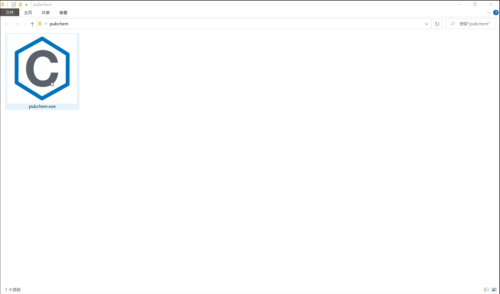

[简体中文](README.zh.md) | English
**Table of Contents**
[toc]
# Introduction
Crawl data of compounds from [PubChem](https://pubchem.ncbi.nlm.nih.gov/) by **CID** based on [PubChem PUG REST API](https://pubchemdocs.ncbi.nlm.nih.gov/pug-rest).
# Demo

# Install
```bash
pip install requests
```
# Usage
1. `Git clone` the repo.
```bash
git clone https://github.com/XavierJiezou/python-pubchem-api.git
```
2. `Cd` to the root path.
```bash
cd python-pubchem-api
```
3. Write cid list to `cid.txt`.
4. Run `python pubchem.py`.
5. Results can be seen in `data.json` or `data.csv`.
6. You can also modify the variable `self.property_list` in [pubchem.py](pubchem.py) according to the `Compound Property Tables` below.
```python
self.property_list = [
            'IUPACName',
            'IsomericSMILES',
            'MolecularFormula',
            'MolecularWeight',
            'HBondDonorCount',
            'HBondAcceptorCount'
        ]
```
# Compound Property Tables
More than one property may be requested, in a comma-separated list of property tags in the request URL. Valid output formats for the property table are: XML, ASNT/B, JSON(P), CSV, and TXT (limited to a single property). Available properties are:
| **Property**             | **Notes** |
|:------------------------|:---------|
| MolecularFormula         | Molecular formula. |
| MolecularWeight          | The molecular weight is the sum of all atomic weights of the constituent atoms in a compound, measured in g/mol. In the absence of explicit isotope labelling, averaged natural abundance is assumed. If an atom bears an explicit isotope label, 100% isotopic purity is assumed at this location. |
| CanonicalSMILES          | Canonical SMILES (Simplified Molecular Input Line Entry System) string.  It is a unique SMILES string of a compound, generated by a “canonicalization” algorithm. |
| IsomericSMILES           | Isomeric SMILES string.  It is a SMILES string with stereochemical and isotopic specifications. |
| InChI                    | Standard IUPAC International Chemical Identifier (InChI).  It does not allow for user selectable options in dealing with the stereochemistry and tautomer layers of the InChI string. |
| InChIKey                 | Hashed version of the full standard InChI, consisting of 27 characters. |
| IUPACName                | Chemical name systematically determined according to the IUPAC nomenclatures. |
| Title                    | The title used for the compound summary page. |
| XLogP                    | Computationally generated octanol-water partition coefficient or distribution coefficient. XLogP is used as a measure of hydrophilicity or hydrophobicity of a molecule. |
| ExactMass                | The mass of the most likely isotopic composition for a single molecule, corresponding to the most intense ion/molecule peak in a mass spectrum. |
| MonoisotopicMass         | The mass of a molecule, calculated using the mass of the most abundant isotope of each element. |
| TPSA                     | Topological polar surface area, computed by the algorithm described in the paper by Ertl et al. |
| Complexity               | The molecular complexity rating of a compound, computed using the Bertz/Hendrickson/Ihlenfeldt formula. |
| Charge                   | The total (or net) charge of a molecule. |
| HBondDonorCount          | Number of hydrogen-bond donors in the structure. |
| HBondAcceptorCount       | Number of hydrogen-bond acceptors in the structure. |
| RotatableBondCount       | Number of rotatable bonds. |
| HeavyAtomCount           | Number of non-hydrogen atoms. |
| IsotopeAtomCount         | Number of atoms with enriched isotope(s) |
| AtomStereoCount          | Total number of atoms with tetrahedral (sp3) stereo [e.g., (R)- or (S)-configuration] |
| DefinedAtomStereoCount   | Number of atoms with defined tetrahedral (sp3) stereo. |
| UndefinedAtomStereoCount | Number of atoms with undefined tetrahedral (sp3) stereo. |
| BondStereoCount          | Total number of bonds with planar (sp2) stereo [e.g., (E)- or (Z)-configuration]. |
| DefinedBondStereoCount   | Number of atoms with defined planar (sp2) stereo. |
| UndefinedBondStereoCount | Number of atoms with undefined planar (sp2) stereo. |
| CovalentUnitCount        | Number of covalently bound units. |
| Volume3D                 | Analytic volume of the first diverse conformer (default conformer) for a compound. |
| XStericQuadrupole3D      | The x component of the quadrupole moment (Qx) of the first diverse conformer (default conformer) for a compound. |
| YStericQuadrupole3D      | The y component of the quadrupole moment (Qy) of the first diverse conformer (default conformer) for a compound. |
| ZStericQuadrupole3D      | The z component of the quadrupole moment (Qz) of the first diverse conformer (default conformer) for a compound. |
| FeatureCount3D           | Total number of 3D features (the sum of FeatureAcceptorCount3D, FeatureDonorCount3D, FeatureAnionCount3D, FeatureCationCount3D, FeatureRingCount3D and FeatureHydrophobeCount3D) |
| FeatureAcceptorCount3D   | Number of hydrogen-bond acceptors of a conformer |
| FeatureDonorCount3D      | Number of hydrogen-bond donors of a conformer. |
| FeatureAnionCount3D      | Number of anionic centers (at pH 7) of a conformer. |
| FeatureCationCount3D     | Number of cationic centers (at pH 7) of a conformer. |
| FeatureRingCount3D       | Number of rings of a conformer. |
| FeatureHydrophobeCount3D | Number of hydrophobes of a conformer. |
| ConformerModelRMSD3D     | Conformer sampling RMSD in |
| EffectiveRotorCount3D    | Total number of 3D features (the sum of FeatureAcceptorCount3D, FeatureDonorCount3D, FeatureAnionCount3D, FeatureCationCount3D, FeatureRingCount3D and FeatureHydrophobeCount3D) |
| ConformerCount3D         | The number of conformers in the conformer model for a compound. |
| Fingerprint2D            | Base64-encoded PubChem Substructure Fingerprint of a molecule. |
# Property API
Get the property from cid.

---
**Example:**
[https://pubchem.ncbi.nlm.nih.gov/rest/pug/compound/cid/1,2,3,4,5/property/MolecularFormula,MolecularWeight/JSON](https://pubchem.ncbi.nlm.nih.gov/rest/pug/compound/cid/1,2,3,4,5/property/MolecularFormula,MolecularWeight/JSON)
# Synonym API
Get the synonym from cid.

---
**Example:**
[https://pubchem.ncbi.nlm.nih.gov/rest/pug/compound/cid/1,2,3,4,5/synonyms/JSON](https://pubchem.ncbi.nlm.nih.gov/rest/pug/compound/cid/1,2,3,4,5/synonyms/JSON)
# Build
```bash
git clone https://github.com/XavierJiezou/python-pubchem-api.git
cd python-pubchem-api
pip install pipenv
pipenv install
pipenv shell
pip install requests
pip install pyinstaller
pyinstaller -F -i favicon.ico pubchem.py
```
# Download
- Github: [pubchem-1.0.2-win64.zip](https://github.com/XavierJiezou/python-pubchem-api/releases/download/1.0.2/pubchem-1.0.2-win64.zip)
- Lanzou: [pubchem-1.0.2-win64.zip](https://ghgxj.lanzoui.com/iJkums1a21c)
# Status Codes
| HTTP Status | Error Code            | General Error Category                                                    |
|-------------|-----------------------|---------------------------------------------------------------------------|
| 200         | (none)                | Success                                                                   |
| 202         | (none)                | Accepted (asynchronous operation pending)                                 |
| 400         | PUGREST.BadRequest    | Request is improperly formed (syntax error in the URL, POST body, etc.)   |
| 404         | PUGREST.NotFound      | The input record was not found (e.g. invalid CID)                         |
| 405         | PUGREST.NotAllowed    | Request not allowed (such as invalid MIME type in the HTTP Accept header) |
| 504         | PUGREST.Timeout       | The request timed out, from server overload or too broad a request        |
| 503         | PUGREST.ServerBusy    | Too many requests or server is busy, retry later                          |
| 501         | PUGREST.Unimplemented | The requested operation has not (yet) been implemented by the server      |
| 500         | PUGREST.ServerError   | Some problem on the server side (such as a database server down, etc.)    |
| 500         | PUGREST.Unknown       | An unknown error occurred                                                 |
# Reference
> [https://pubchemdocs.ncbi.nlm.nih.gov/pug-rest](https://pubchemdocs.ncbi.nlm.nih.gov/pug-rest)